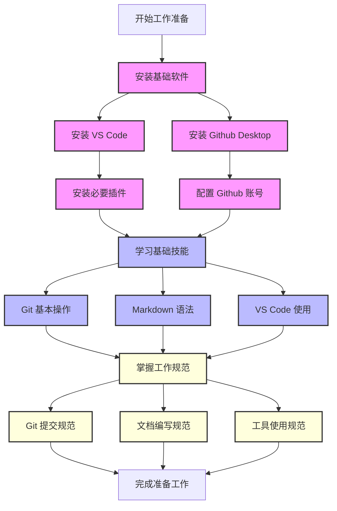
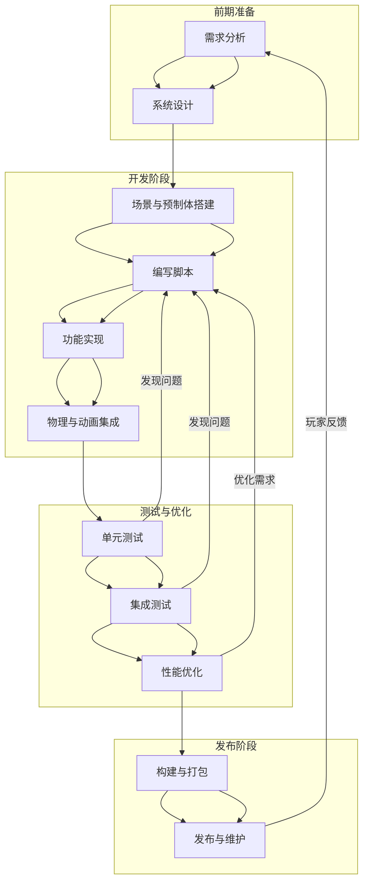
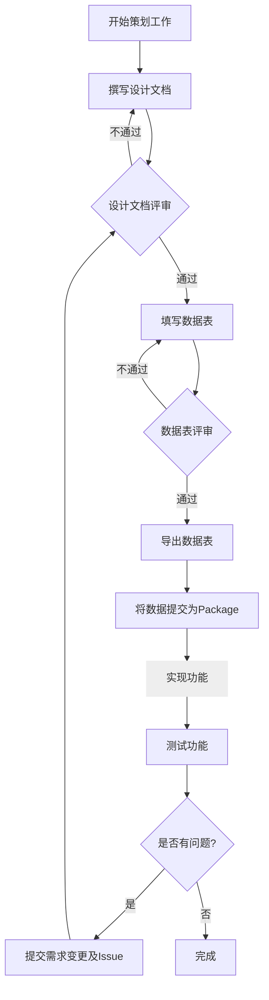
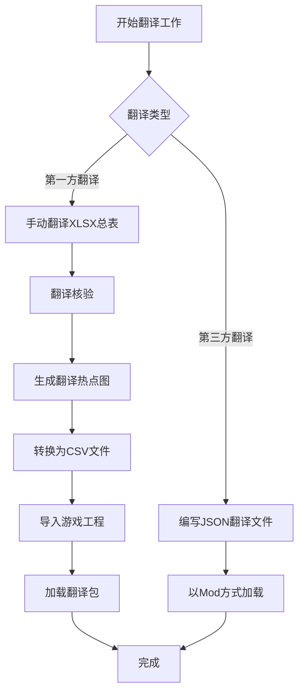
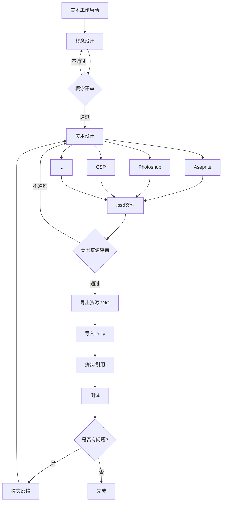

# Whiteverse 团队工作流

我们在此总结 Whiteverse 项目的技术栈需求以及标准化工作流建议。
除此之外，我们还会在此记录一些项目中的设计经验和技巧，以便于团队成员更好地理解项目的设计规范。
请按需阅读本文档，以便更好地理解我们的工作流程。

## 工作原则

1. **工作留痕**：对自己的工作内容留有记录；
2. **版本控制**：保证项目的透明、可追溯；
3. **单一数据源(SSOT)**：所有数据从一个权威位置获取，避免重复工作或文件管理系统混乱；
4. **团队协作**：保证团队成员之间的工作协调，互不冲突；
5. **安全性**：提升项目资料的容灾能力，避免数据丢失；
6. **多平台**：支持多种操作系统，方便团队成员的使用；

## **基础技术栈**

本章节讨论了在团队开展工作之前所有角色都应当掌握的技术与工具。



### **Github Desktop**

在工作中，我们使用 `Github` 进行代码和文档托管。因此，必须掌握 `Github Desktop` 的基本使用方法，包括克隆、提交、拉取、分支等操作。同时，还应当掌握 `Git` 使用的基本规范，以下是我们提倡的使用规范：

- **提交信息 Commit Message**： 应当简洁明了，能够清晰地表达本次提交的内容，不应当出现无意义的 `Commit Message`。
- **变动记录 Diff**： 应当仔细查看每次拉取内容的更改，确保对项目的更改有清晰的认识。
- **提交原子化**：每次提交应当专注于一个小的功能或修复，避免将多个不相关的更改混合在一起。
- **分支管理**：
  - 不要在主分支（如 `main` 或 `master`）上进行开发，应当在功能分支上进行开发。
  - 一个分支应当只负责一个主要功能，完成后及时通过 `Pull Request` 提交审核。
  - 合并后及时删除分支，保持仓库整洁。
- **Pull Request**：提交 PR 后，由审核人进行代码审查，确保代码质量和功能完整性。

由于学习成本限制，不要求掌握 `Git` 的高级用法或者命令行操作，但是应当掌握 `Github Desktop` 的基本操作。

使用 Git 代表团队工作流的技术原则，是我们工作的基础。

_P.S. 使用 `Github` 需要翻墙。_

#### **Git, Github, Github Desktop, Gitlab, SVN 的区别**

- **Git**：工具，用来管理文件变化。
- **GitHub**：托管 `Git` 项目的网站。
- **GitHub Desktop**：简化 `Git` 操作的桌面应用。
- **GitLab**：类似 `GitHub` 的软件服务，可以自己部署。
- **SVN**：另一种版本控制工具，集中化管理。

### **Markdown**

相较于二进制文件，我们更倾向于使用文本文件，这样可以更好地进行版本控制和协作，这也是我们工作流的基本原则。

- 所有的文字性工作文档应当以 `Markdown` 形式呈现，**不允许**使用 `Word` 文档。
- 应当熟练掌握 `Markdown` 的基本语法，并且能够通过 `MarkdownLint` 的检查。
- 请用 Markdown 结合插件满足诸如表格、代码块、公式、思维导图等**任何需求**。善用插件，提高工作效率。

### **Visual Studio Code**

**必须**使用 `VSCode` 作为主要的文本/代码编辑器，并且根据库的需求和建议安装相应的插件。基本的插件如下：

- **Edit csv**：编辑 CSV 文件。
- **Markdown Preview Enhanced**：增强 Markdown 预览功能。
- **MarkdownLint**：检查 Markdown 语法规范。
- **Prettier - Code formatter**：自动格式化代码。
- **Rainbow CSV**：高亮显示 CSV 文件内容。
- **Color Highlight**：高亮显示颜色代码。

_P.S. 请不要使用 NotePad++、Typora 等不同规范的编辑器。_

### **CSV, YAML, JSON, Excel**

在项目中，我们使用 `CSV`、`YAML`、`JSON` 等格式来存储数据，因此应当掌握这些格式的基本语法和使用方法。

- **Excel 使用规范**：
  - 我们不使用 `Excel` 进行数据传输，只使用 `Excel` 进行数据设计与编辑。
  - 在每次编辑完成后，应当使用脚本将其转换为相应的数据格式（如 CSV、JSON），再进行提交。
  - **禁止**直接提交二进制 `Excel` 文件，除非编辑不涉及数据变动。

### **使用 AI 工具**

当下，AI 已经成为了设计的重要工具，我们应当掌握 AI 工具的基本使用方法，以提高工作效率。但是 AI 工具的使用应当是辅助性的，不应当取代人工的创造性工作。应当明确以下几个原则：

- **禁止使用 AI 进行创作**：任何涉及核心创意的工作（如文本创作、设计创作、艺术创作等）禁止直接使用 AI 工具生成最终成果。创作过程应当以人类的独特思维和创造力为主导，AI 仅可作为灵感辅助工具。
- **谨慎使用 AI 进行数据生成**：AI 工具在数据生成和推理任务中可能存在偏差或错误，尤其是在涉及复杂逻辑或专业知识时。因此，AI 生成的数据或推理结果必须经过人工验证和校准，以确保其准确性和可靠性。
- **代码生成**：AI 工具可以用于生成代码片段或自动化重复性编码任务，但生成的代码必须经过人工审查，确保其质量、可读性和安全性。同时，生成的代码应符合项目规范和最佳实践。

### **Teambition**

使用 `Teambition` 参与项目管理，即时更新任务进度，及时反馈问题，保持团队的协作性。
项目绩效评估将会参考 `Teambition` 的任务完成情况。

- 在创建任务时，应当明确任务的目标、（备注中的）任务具体内容、递归的子任务、预计时常和故事点。
- 在完成任务时，应当及时更新任务状态，填写任务备注，以便于他人查看任务进度。
- 在遇到问题时，应当及时在任务下方评论，提出问题，寻求解决方案。
- 测试项目时，必须在 `Teambition` 中提交任何遇到的 `Issue`，并通过正规的任务解决流程进行处理。所有 `Issue` 必须保持公开、有记录。

### **企业微信**

使用企业微信进行工作沟通，及时回复消息，保持沟通畅通。

- 填写日报和定期的项目汇报，及时更新工作进度。
- 使用审批系统进行请假等工作。
- 在工作时间内保持在线状态，及时回复消息。
- 减少非工作时间沟通或普通微信沟通，保持工作和生活的分离。

### **阅读文档**

我们要求每个团队成员都具有良好的阅读文档能力，能够快速理解和应用文档中的内容，并且通过参考文档进行工作。

- 在遇到问题时，应当首先查阅文档，尝试自行解决问题。
- 与项目成员以及主管及时沟通，保持知会。
- 每次使用文档前，查看最新版本，尤其是变动的部分（这一环节通过查看 `Diff` 进行）。

### **英语能力**

英语能力并非仅指对于语言本身的掌握程度，而是指对正确语义的理解和表达：比如统一化的命名、关键名词的使用和近义词的区分等，避免产生任何歧义。
如果项目已经存在了相关术语表，应当遵循术语表中的规范进行命名，在设计术语时，更应该与项目成员和主管进行沟通和论证。切勿随意更改术语。
同时，项目成员应当具备一定的英文阅读能力或使用翻译工具的能力；后者应当注意翻译工具的准确性，懂得分辨正误。

## **程序工作应当掌握的能力**

在开展工作之前，除了基础技术栈，程序（软件工程师）应当掌握以下技术、工具和规范：

### **代码规范**

我们要求所有的代码都应当遵循一定的代码规范，以保证代码的质量和可维护性。请参考并遵循以下规范：
[使用 C#风格指南编写简洁且可扩展的游戏代码（Unity 6 版）](https://unity.com/cn/resources/c-sharp-style-guide-unity-6)

### **注释**

这里是一些需要额外强调的注释规范：

1. 使用 XML 文档注释（`///`）描述公共方法和 API。
2. 注释代码的意图，而非实现细节。
3. 使用 `TODO` 注释标记未完成的工作。
4. 保持注释风格一致。
   - 使用 `///` 进行 XML 文档注释。
   - 使用 `//` 进行单行注释。
   - 使用 `/* */` 进行多行注释（尽量避免使用，除非必要）。

## **策划工作应当掌握的能力**

在开展工作之前，除了基础技术栈，策划应当掌握以下技术、工具和规范：

### **MediaWiki**

我们使用个人部署的 `MediaWiki` 作为团队的知识库，因此应当掌握 `MediaWiki` 的基本使用方法，包括但不限于：

- 理解 `MediaWiki` 的基本原理，懂得浏览和维护 `MediaWiki` 页面。
- 熟练掌握 `MediaWiki` 的基本语法，包括标题、列表、表格、链接等。它和 `Markdown` 有很多相似之处，但也有很多不同之处，应当注意区分。
- 熟练使用 `MediaWiki` 的模板功能，以便于更好地组织文档。

### **Excel**

使用 Excel 进行数据设计时，应当注意以下原则：

- **数据规范化**：避免多余空格、空白行或空白列。
- **表头标准化**：采用唯一列名，使用小驼峰命名法。尽量不要使用中文。
- **数据类型规范化**：避免混合数据类型，保证与设计原意一致。
- **禁止合并单元格**：合并单元格会影响数据分析和处理。
- **工作表命名规范化**：为每个工作表起一个清晰的名字。
- **使用公式**：避免硬编码，尽量使用公式进行数据计算。

## 美术工作应掌握的能力

在开展工作之前，除了基础技术栈，美术应当掌握以下技术、工具和规范：

### **Photoshop**

我们推荐使用 `Photoshop` 进行 2D 美术设计，但是不强制要求。然而提交的终端应当是 `PSD` 文件。具体原则可以查看后续章节的[美术工作流](#美术工作流)。在此，列出一些基本的工作原则，不涉及具体的技术细节：

- **图层命名**：图层命名应当简洁明了，能够清晰表达图层的内容，不允许出现无意义的图层命名。
- **图层分组**：图层应当按照功能进行分组，以便于后续的管理和导出，一个拥有多层的实体应当对应一个同名的分组。
- **唯一性**：保证 `PSD` 文件的唯一性，借助 `Git` 进行管理，不可出现以日期命名或者无意义命名的文件。
- **导出**：无需导出 `PNG` 文件，应只提交 `PSD` 文件。

### **Spine**

为保证导入时的便捷性，在导入图片到 Spine 时，不应裁切图片，而是保持画布大小，以便于在 Spine 中进行统一调整。

---

## 程序工作流



## 策划工作流



## 翻译工作流



本章节以物品为例讨论游戏翻译工作流。

### 第一方人工翻译

特指在游戏开发时进行的第一方翻译。在总表 `xlsx` 进行手动翻译。
此过程原则上应当保证无机器翻译或 AI 翻译混杂，以保证翻译的高质量。

#### 翻译核验

在完成翻译工作后，应当进行翻译核验，目的是筛选翻译的问题，包括但不限于：

1. 机器翻译成分过高；
2. 原文修改后未及时更新翻译；
3. 专有名词、保留词未翻译或错译；

通过翻译核验生成翻译热点图，以便于后续的翻译工作。

#### 翻译导入

完成本次翻译迭代后，将翻译文件转换成`i18n_item.csv`和`i18n_item_d.csv`。
提交后，游戏工程应当引入翻译包(`Package`)，并在游戏启动时加载翻译包。
通过内置的 `Localization`，手动将翻译文件导入到已有的 `Localization` 表格中。

#### 第三方人工翻译

特指游戏产品化之后的基于游戏的追加翻译，可对原本翻译内容进行覆盖。
第三方翻译不适用 `csv` 文件，而是使用 `json` 文件进行 `key` 的映射。
在翻译完成后，将以类似 `Mod` 的方式进行动态加载。

## 美术工作流



我们建议使用 Photoshop 进行绘图，并使用.psd 文件进行保存、转移和交接。
使用 Photoshop 进行绘图时，伴随软件特性产生的一些问题，需要特别注意。以下是一些常见的问题和解决方案：

### 像素画工作流程

- Photoshop 版本大于 2020
- 将图像插值调整为邻近
  
- 将高速缓存级别调至 2，高速缓存拼贴大小调至 128k，历史记录随意（取决于用户电脑配置）。
  
- 将标尺与文字单位调整为像素
  
- 使用铅笔工具绘画，关闭平滑，否则会导致画笔延迟漂移
  
- 使用油漆桶进行范围填色，容差调整为 0，禁用消除锯齿，连续选项视情况而定
  
- 使用橡皮工具进行修改，切换到铅笔模式
  
- 在执行图像缩放时，需要注意三点：
  - 为保证放大的像素不因奇偶差异而变形，应当通过调整图像的放大中心为左上 👉 使其 XY 坐标定位达到像素精确（例：10.00 像素）。
  - 应当使图像的放大倍数为整数倍，如 200%、300%，而非 150%或 112%
  - 插值必须调整为邻近
    

### 像素画的线条

### 斜线

像素画中的直线是由一系列的等长线段构成的。在像素画中，角度与线段的关系是这样的：


一般来说，在绘制角度时，应当遵循以下规则：

1. 22.5°(1/16)、30°(1/12)、45°(1/8)、60°(1/6)、90°(1/4)、是最基本的角度，应当尽量避免使用其他角度。
   由于像素的特性，这些角度可以保证线段的长度是整数像素，这样可以保证线段的清晰度。
   135°、225°、315° 是 45° 的倍数，也是可以接受的角度。
2. 像素线段长度和角度存在这样的关系：

```math
length = 90/angle - 1
```

这个公式可以帮助我们计算出在绘制特定角度时，线段的长度应当是多少。而该公式表明了一个重要的事实：在绘制介于 30° 到 60° 之间的角度时，线段的长度会产生不完美的像素，这是因为在这个范围内，线段的长度不是整数像素，这样会导致线段的不完美。应当尽量通过其他方式避免这种情况。


红色部分是危险区域，绿色部分是安全区域。在绘制时，应当尽量避免使用危险区域的角度。
当不得不使用危险区域的角度时，可以通过曲线来代替直线，这样可以一定程度上避免问题产生。

### 像素画的曲线

像素画中的曲线是由一系列长度等差的线段构成的。在像素画中，曲线的绘制是一个复杂的问题，因为曲线的长度和角度都会影响曲线的质量。

一个平滑的曲线中的线段长度 y 与线段次数 x 存在一定的相关性：


```math
A: y = x
B: y = [n/2]
C: y = [(n+1)/3]
D: y= 3n-2
E: 斐波那契数列
```

由此可得出推论：

1. 曲线一定符合数列规律，可以通过数列规律来推断曲线的长度。
2. 曲线的线段长度应当是整数像素，即使需要取整符号。

### 像素画的圆

在 Photoshop 中，如果使用**铅笔**进行圆的绘制，需要注意的是，笔刷的大小决定了圆的直径，基于此，圆必须是**奇数**像素，这样才能保证圆心在像素上。如果是偶数像素，圆心会落在像素之间，导致圆的不完美。
如果想要绘制直径为偶数像素的圆，可以通过绘制直径为奇数像素的圆，然后通过框选工具进行裁剪，这样可以保证圆心在像素上。


如图所示， 直径个位为 3~5、5~7 的圆之间有明显的阶梯感，它的最长线段长度会突变。
直径个位为 3 和 7 的圆存在像素不完美问题，需要手动调整修边。本图是已经修复后的。

### 像素画的视角

在像素画中，视角是一个重要的概念，它决定了物体的组成方式和绘制方式。
一个项目一般会有一个固定的视角，这样可以保证整个项目的一致性。

#### Top-down 俯视视角

摄像机以固定角度观察被摄物体，在这种视角下，物体拥有两个面，一个是顶面，一个是立面。为了表现物体的立体感，除了两个面的对比度、高光（第三面）之外，还应该在设计图案的时候做好体积暗示。

##### 高度问题

一个占地面积 2x2(x16)的立方体物体，高度为 2(x16)。那么问题来了，这个物体在实际绘制时它的立面和顶面的像素是怎么分配的呢？


如图所示，如果立面的像素长度按照本身的设计长度绘制，在俯视视角下它的体积不能被传达到位，因为摄像机的视角是 40°~45° 角(≈41.41∘)倾斜于地面的。


所以在尽可能保留顶面原大小的同时，立面的像素长度应当缩短，这样可以更好的传达物体的体积。缩短的公式如下：

```math
height' =  height * 3/4
```

对于像素游戏，视觉上的 3/4 视角通常通过美术调整，而不是依赖于精确的 3D 透视算法。角色和场景素的高度通常由手工像素美术来决定。

##### 光照来源


1. 描边：一般情况下不进行绘制；
2. 顶面：受光面，物体的固有色；
3. 高光：物体中最亮的部分；
4. 立面：不受光的面，物体固有色的亮度降低版本。可能存在反光，反光挤压明暗交界线；
5. 投影：左右比形体各扩展 2px，以保证在有描边的情况下投影仍然能够正确显示。

俯视视角的光照来源无论在任何情况下都是默认顶光，且无色温影响。这代表了任何一个物体都**不应该**受光源着色，即是说，物体的亮暗面都是灰调的。

上述说法仅用于拥有后处理过程的游戏引擎，引擎会自动为物体进行光照上色。在其他绘制场景中，仍然需要对亮暗面进行色彩冷暖的调整。

死区缺陷问题 <https://zhuanlan.zhihu.com/p/686230441>

#### Isometric 等距视角

待完善。

#### Scroll-side 卷轴视角

卷轴视角的摄像机平行于被摄物体，这导致物体的立体感不明显。物体拥有 1~2 个面：有时作为背景的物体垂直于摄影机，只展示一个面，但是即便事实上垂直于摄影机的场合，也可能为了照顾体积感而绘制两个面。

这与摄影机的距离有一定的关系，距离越近，体积感越强；距离越远，露出的面就约少。

卷轴视角的光照来源本应是顶光，但是角度问题导致卷轴视角的物体没有顶面，因此我们在项目建立时就确定好光照来源（于左侧或是右侧）

一般情况下我们会选择左侧光源。但是某些环境自带光的情况下需要对亮暗面进行调整，甚至使用法线贴图。不过大部分情况下，这是不必要的——玩家往往不会注意到这些细节。


如图所示，这是一个通过亮暗面加上些微的边缘宽度调整体现物体体积的例子。

大部分情况下，光照射进场景的范围是有限的，距离稍远的物体受光影响较小。另外，远处的物体的颜色应当更灰，以表现大气的影响。但是这存在例外。在某些情况下，极远处的物体应当更亮，以表现远处的外部光源，如远山、远处的建筑等，这些物体应当更亮、融入天空。

### 置入

痛点：

1. 直接置入会因为坐标重置、DPI 自动调整等原因偏移图片的周围像素；
2. 如果通过复制图层的方式无损置入，会丢失图片的名称；

最优解：先通过引擎或其他 Batch 方式给需要的图片加上透明描边，然后统一拖入 Photoshop 中，这样可以保证图片的描边一致性。

详细参考[文件目录](./Preprocessing/addTransparentBorder.py)。

在 Photoshop 中，图片的批量置入需要注意以下几点：

- 原始文档的 DPI 需要与置入图片的 DPI 一致，否则会导致图片的像素丢失——即使在设置中设定了“不缩放”；
- 应当在设置中将置入的图片自动转换为智能对象，以便于后续的修改；
- 置入后，应当选择智能对象，并右键图层，选择“恢复缩放”以保证图片的原始尺寸。

### 图层

- 不同物体需要分层。
- 在设计上有特别的的叠压关系时应当单独分图层，如侧面的阳台。
- 允许合层的情况：

- 不影响结构整体性的
- 不影响或没有交互方式的
- 可以作为整体 SpriteSheet 裁切的

- 图层命名必须统一且明确，名称采用大驼峰，并用下划线连接名称和它的属性，如 Shadow、Back、Front、Frame 等字段。出现“图层”“拷贝”等名称是**不被允许**的，这样的图层不应当加入导出序列，仅用作指示画面效果。下面是一个例子：

- House_Back
- House_Front
- House_Frame_1
- House_Frame_2
- House_Texture
- House_Shadow

在导出时，也应当遵循这一规则，以保证导出的文件名和图层名称一致。

- 可以定义图层名称属性的缩写，应当说明。以下是一些常用的缩写和意义：

  | 缩写 | 英文    | 含义       |
  | ---- | ------- | ---------- |
  | b    | back    | 背后       |
  | f    | front   | 前，可省略 |
  | s    | side    | 侧面       |
  | w    | shadow  | 投影       |
  | t    | texture | 材质、纹理 |

### 描边

- 在设计时应当保留物品的边缘尺寸，以便于在游戏中添加自动描边。举例说明：在绘制一个 32x32 的物品时，应当在物品的边缘留出**1px 的空白**，也就是说物品的实际尺寸为 30x30，这样在游戏中添加描边时就不会出现物品之间的重叠。
- 以下情况**绝不允许**：
- 使用现实的图片直接作为底图描绘，再在上面进行修改。
- 除非有特殊需求，绘制时半透明笔刷直接出现在画布上。这会导致游戏中颜色自动描边后的异常混合。
- 当一组物体的描边是选择性的，整体中存在不需要描边的地方，应当在预定的描边位置绘制**alpha = 10% ~ 20%**的黑色，引擎会自动识别并将此处颜色重设为**全透明黑色**。
- 当一组物体的描边是不需要的，就不必再预留 alpha，直接绘制即可。

### 投影

- 投影一般情况下**alpha = 33%**，颜色为黑色。如果主体有描边，投影应该在两侧扩展至少**1px**，以保证投影的完整性。
- 如果一个物体的投影是选择性的，已经在主体上绘制了硬性投影（环境光遮蔽），仍然需要导出相应的投影文件，该文件可以是空图片。

### 发光贴图

由于采用了 URP 渲染管线，我们可以使用 Emission Map 来实现发光效果。

需要为发光部分单独绘制一张贴图，贴图的尺寸应当与主体贴图一致。在需要发光的位置用任何需要的颜色标注，其明亮程度可以通过控制 Alpha 调整。

在导出时，应当将发光贴图与主体贴图分开导出，以保证在游戏中的正确使用。

在 Unity 中，发光贴图的 TextureType 应当设置为 Default，并在原有的贴图编辑器(Edit Sprite) 中，添加一个**Secondary Texture**，将其名称设置为**\_EmissionMap**，然后将发光贴图拖入其中。

这样结合 URP 的 Volume 设定 (**threshold = 1,intensive = 0.3**) 就可以实现指定发光的效果。

这样的功能是通过 shader 中 HDR 颜色来辅助实现的，因为 HDR 颜色强度可以超过 1，所以我们可以通过这种方式来指定阈值大于 1 的贴图来实现发光效果。

## 地牢饿徒实践

本章节讨论了在游戏《地牢饿徒》中的一些特别的设计规范和技巧。本游戏是一个 2D 像素风格的游戏，经历的版本同时进行了 Topdown 和 Sidescroll 视角的绘制，在 Unity 中使用了 Shader, URP 等技术，因此具有一些参考价值。

### 地图实体 Map Object

指拥有体积和碰撞的物体 Prefab。

#### 碰撞体

在具体的 SpriteRenderer 上添加碰撞体，而不是在空物体或父物体上添加，这可能会导致碰撞体重叠或者不符合物体形状。

在制作拥有严格形状的碰撞体时，应该采用 Polygon Collider 2D ，而不是 Box Collider 2D 。这样可以更好地适应物体的形状。

适用 Polygon Collider 2D 时，可以预先在 Sprite 中定义物理形状 **Custom Physics Shape** ，这样可以更好地适应物体的形状。

#### 投影与光效

为了光效表现，应该在物体上添加 Shadow Caster 2D。像碰撞体一样，Shadow Caster 也应该与物体的形状一致。

如果是一个物体中，有多个形状，那么应该为每个形状添加一个 Shadow Caster 2D。

添加后，在根物体上添加一个 Composite Shadow Caster 2D。

可能出现的问题：Edit Shape 编辑形状时可能出现锚点点击后自动归零的情况，这通常是因为物体的 Transform 有问题，Z 轴为 0 时会出现这种情况。

### 建筑

- 屋顶单独分层，为了屋顶的差异化和自定义。
- 在基本框架绘制完毕后绘制纹理层#tex，以保护原有结构色彩。
- 屋顶在绘制时，统一采用亮色进行绘制，并在完毕前将右侧房顶亮度调低 50。
- 投影一般情况位于建筑形状下方 5 格，比两侧各多 2 格，多出的 1 格是照顾到系统自动描边遮挡。

#### 建筑的导入

- 注意在 GameObject 命名时，应当使用大驼峰命名法，如：House、Wall、Roof 等。
- 命名时，应当注意保留名称字段。
  以下是一些常用的字段和意义：

  | 字段            | 含义                                            |
  | --------------- | ----------------------------------------------- |
  | Shadow(#Shadow) | 投影，在 MapRenderer 预处理过程中将不会进行描边 |
  | #tex            | 材质纹理，用于保护原有结构色彩                  |
  | #Light          | 灯光物体，仅用于保存 Light 2D 灯光效果          |

- 导入图片时，由于图片大小的不确定性和重复修改性，不建议保存为 SpriteSheet，而是直接导入单张图片，以便于后续的修改。

- 请使用我们提供的工具进行导入后的预处理，16x 加透明描边。
- 关于描边：

我们提供了两种材质：UnitOutline 和 UnitWithoutLine。前者是带有描边的，后者是不带描边的。在导入时，应当根据实际需求选择。

描边遵循以下规则：

- 每一个 Prefab 是一个描边整体，在整体中的任何物体都将共享整体的最大边缘描边。也就是说，如果将一个已经描边的预制体放进另一个预制体中，那么这个预制体的描边将会被覆盖。

- 如果预设了描边，那么在游戏中就忽略这项描边工作。为保证一致性，笔者建议在导入、制作 Prefab 时不要预设描边，把工作交给自动化，做好标记即可。如果已经预设了描边 UnitOutline，理论上不会有影响，但还是建议不要过多预设描边。

- 严格区分动态和静态物体，动态物体指会在游戏中产生位移、角度、尺寸或开关变化的物体。标记静态的方法是在静态物体的 Prefab 根目录添加一个名为**$**的空物体。

  静态物体作为一个整体，它的描边将会被应用到整个物体上，并且在游戏加载后不再修改。动态物体的描边则会在游戏运行时动态生成。
