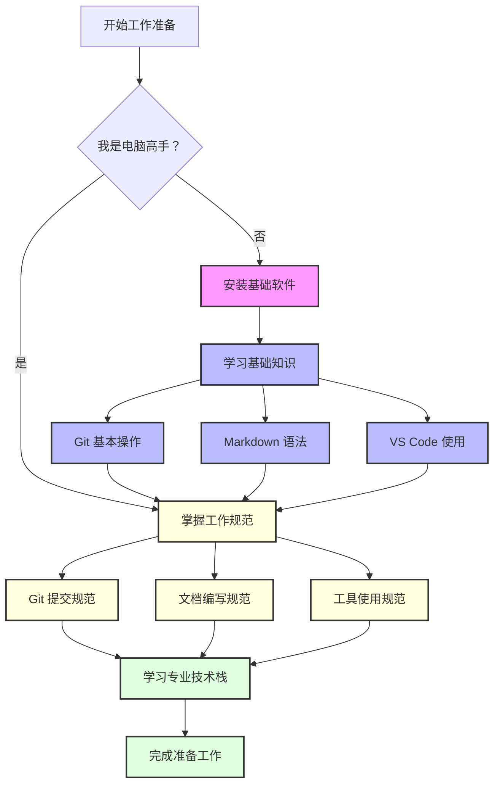

# Whiteverse 团队工作流

我们在此总结 Whiteverse 项目团队使用的技术栈需求以及标准化工作流建议。
除此之外，我们还会在此记录一些项目中的设计经验和技巧，以便于团队成员更好地理解项目的设计规范。
请按需阅读本文档，以便更好地理解我们的工作流程。

接下来的所有内容都以高效合作为核心指导，解放创造力为理想目标。因此如有任何建议和意见，欢迎提交 `Issue` 或 `PR`。

## 目录

- [Whiteverse 团队工作流](#whiteverse-团队工作流)
  - [目录](#目录)
  - [工作原则](#工作原则)
  - [**部署工作环境**](#部署工作环境)
  - [**基础技术栈**](#基础技术栈)
    - [**GIT \& Github Desktop**](#git--github-desktop)
      - [**Git, Github, Github Desktop, Gitlab, SVN 的区别**](#git-github-github-desktop-gitlab-svn-的区别)
    - [**Markdown**](#markdown)
    - [**Visual Studio Code**](#visual-studio-code)
    - [**文件命名**](#文件命名)
    - [**CSV, YAML, JSON, Excel**](#csv-yaml-json-excel)
    - [**使用 AI 工具**](#使用-ai-工具)
    - [**阅读文档**](#阅读文档)
    - [**英语能力**](#英语能力)
  - [**专业技术栈**](#专业技术栈)

## 工作原则

1. **工作留痕**：对自己的工作内容留有记录，无论是汇报总结还是提交记录；
2. **版本控制**：保证项目历史的透明、可追溯；
3. **单一数据源(SSOT)**：所有数据从一个权威位置获取，避免重复工作或文件管理系统混乱；
4. **团队协作**：保证团队成员之间的工作协调，互不冲突；
5. **安全性**：提升项目资料的容灾能力，避免数据丢失；
6. **多平台**：支持多种操作系统，方便团队成员的使用；

## **部署工作环境**

在开始工作之前，请确保你的工作环境已经准备好。
如果你已是电脑高手，请跳过本节。
以下是部署工作环境的步骤。

1. [Git](https://git-scm.com/downloads/win)
2. [Visual Studio Code](https://code.visualstudio.com/Download)
3. [Github Desktop](https://desktop.github.com/download/)
4. [Unity Hub （仅编程测试人员需要）](https://unity.cn/releases)

除了步骤 1，其他软件请创建并登录自己的账号。

## **基础技术栈**

本章节讨论了在团队开展工作之前所有角色都应当掌握的技术与工具。这是加入团队前的准备工作。

### **GIT & Github Desktop**

**使用 Git 代表团队工作流的技术原则，是我们工作的基础。**

在工作中，我们使用 `Github` 托管代码、文档和美术资源。因此，必须掌握 `Github Desktop` 的基本使用方法，包括克隆、提交、拉取、分支等操作。同时，还应当掌握 `Git` 使用的基本规范，以下是我们提倡的使用规范：

- **先学习，再工作**：在开始工作之前，先学习 `Github` 的基本操，先使用自己的仓库练习。
- **先获取，再提交**：
  - 在每天开展工作之前，先拉取最新的代码，确保本地代码是最新的。
  - 在每次提交代码前，先拉取最新的代码并查看变更记录，确保本地代码是最新的。
- **提交信息 Commit Message**： 应当简洁明了，能够清晰地表达本次提交的内容，不应当出现无意义的 `Commit Message`。
- **变动记录 Diff**： 应当仔细查看每次拉取内容的更改，确保对项目的更改有清晰的认识。
- **提交原子化**：每次提交应当专注于一个小的功能或修复，避免将多个不相关的更改混合在一起。
- **分支管理**：
  - 不复刻(`fork`)分支，而是作为`Collaborator`克隆(`clone`)原仓库，否则管理人员无法维护和监督分支内容。
  - 不在主干（如 `main` 或 `master`）上开发，应当在功能分支上开发。
  - 一个分支应当只负责一个主要功能(`feature`)，一个功能应当包含多个原子化提交。
  - 主要功能完成后及时通过 `PR (Pull Request)` 交由审核人审核。
  - 审核通过后审核人将决定是否合并(`merge`)该分支，并给出修改意见
  - 合并后及时删除分支，保持仓库整洁。

_P.S. 使用 `Github` 需要翻墙。_
_P.S.2. 本技术原则仅限`Private`仓库。_

#### **Git, Github, Github Desktop, Gitlab, SVN 的区别**

- **Git**：工具，用来管理文件变化。
- **GitHub**：托管 `Git` 项目的网站。
- **GitHub Desktop**：简化 `Git` 操作的桌面应用。
- **GitLab**：类似 `GitHub` 的软件服务，可以自己部署。
- **SVN**：另一种版本控制工具。

  由于学习成本限制，不要求掌握 `Git` 的高级用法或者命令行操作，但是应当掌握 `Github Desktop` 的基本操作。
  如果使用其他 `git` 工具（如`SVN` `GitKraken` `SourceTree` 等），应当保证提交规范与上述一致，否则可能会导致团队协作的混乱。

### **Markdown**

相较于二进制文件，我们使用文本文件以控制版本和推进协作。

- 所有的文字性工作文档应当以 `Markdown` 形式呈现，**不允许**使用 `Word` 文档。
- 应当熟练掌握 `Markdown` 的基本语法，并且能够通过 `MarkdownLint` 的检查。
- 请用 `Markdown` 结合插件和`mermaid`满足诸如表格、代码块、公式、思维导图等**任何需求**。善用插件，提高工作效率。

P.S. 什么是二进制文件？比如 `Word`、`Excel`、`PSD`、`AI` 等等，这些文件无法通过文本方式查看和编辑（打开时是乱码），必须使用专用软件打开。而 `.md`、`.csv`、`.json` 等都是文本文件，可以直接通过文本编辑器查看和编辑。

### **Visual Studio Code**

**必须**使用 `VSCode` 作为主要的文本/代码编辑器，并且根据库的需求和建议安装相应的插件。

笔者已经在 `.vscode\extensions.json` 中列出了推荐的插件，建议遵循 vscode 的插件推荐机制（扩展-推荐）安装推荐的插件。

P.S. 禁止使用 NotePad++、Obsidian、Notion、Typora 等不同规范的编辑工具。

### **文件命名**

- **禁止使用特殊字符**：如 `\/:*?"<>|` 等，避免文件系统无法识别。但是如果存在强制置顶的情况，可以在文件名前加`#`。
- **重复确认文件大小写规范**：如果使用Windows操作系统，需要注意 Windows 文件系统不区分大小写，但是Git是大小写敏感的，如果这样做会导致版本控制的问题。**一概使用大驼峰命名**，并混合使用下划线 `_` 作为分隔符。比如 `Localization_Names.xlsx`。
- **分隔符**：在文件名中使用统一的分隔符，如下划线 `_`，避免使用`空格`/`连字符 - `/`破折号 —— `/`句号 .`或其他特殊字符。
- **不同的版本**：**不要在文件名中使用版本号，或同时保留多个不同版本的文件**，而是使用版本控制工具（如 Git）来管理文件的版本。如果你对这一条问题存在疑惑，说明需要重新学习版本控制的基本概念。
- **Ignore**：在使用 Git 控制版本时，**不要将不必要的文件添加到版本库中**，如编译生成的文件、临时文件、苹果系统的`.DS_Store`等。可以通过 `.gitignore` 文件来忽略这些文件。

### **CSV, YAML, JSON, Excel**

在项目中，我们使用 `CSV`、`YAML`、`JSON` 等格式来存储数据，因此应当掌握这些格式的基本语法和使用方法。

- **Excel 使用规范**：
  - 我们不使用 `Excel` 传输数据，只使用 `Excel` 设计与编辑数据。
  - 在每次编辑完成后，应当使用脚本将其转换为相应的数据格式（如 CSV、JSON），再提交。
  - 在没有自动化工作流的情况下**禁止**直接提交二进制 `Excel` 文件，除非编辑不涉及数据变动。(如筛选、排序、填色等)

P.S. 什么是自动化工作流？以`Github Action`为例，一个设定好的`Github Action`可以在每次提交后自动将`Excel`转换为`CSV`并提交到指定位置，就解放了手动转换的工作。不过你仍然需要等待`Action`运行完成、`Action`自动提交完成后再拉取最新代码，以确保数据是最新的。
P.S.2. 为什么有时候我的`.csv`文件都是乱码？因为有些软件（如 `Excel`）会将 `CSV` 文件保存为带有特殊编码的格式（如 UTF-8 with BOM），导致无法通过文本编辑器正确显示。反之亦然。

### **使用 AI 工具**

当我们应当掌握 AI 工具的基本使用方法以提高工作效率。但 AI 工具的使用应当是辅助性的，不应当取代人工的创造性工作。应当明确以下几个原则：

- **禁止使用 AI 作为最终创作成果**：任何涉及核心创意的工作（如文本创作、设计创作、艺术创作等）禁止直接使用 AI 工具生成最终成果。创作过程应当以人类的独特思维和创造力为主导，AI 仅可作为灵感辅助工具。
- **谨慎使用 AI 生成数据**：AI 工具在数据生成和推理任务中可能存在偏差或错误，尤其是在涉及复杂逻辑或专业知识时。因此，AI 生成的数据或推理结果必须经过人工验证和校准，以确保其准确性和可靠性。
- **代码生成**：AI 工具可以用于生成代码片段或自动化重复性编码任务，但生成的代码必须经过人工审查，确保其质量、可读性和安全性。同时，生成的代码应符合项目规范和最佳实践。
- **了解 AI 的能力边界**：AI 能够做到什么？AI会伪装能够做到但实际存在问题的是什么？AI 完全不能做到什么？与时俱进地了解 AI 技术的发展和局限性，避免过度依赖或误用 AI 工具。

AI 审查：任何审核人员有权质疑生成的内容，即便它未被标注为 AI 生成。审核人员有权要求提供生成内容的来源和依据，并对确认为 AI 生成的内容有修改和否决权。
隐私责任：如果你认为某些资料是不可以展示给人类的，那么它同样不应该被 AI 使用和学习。

### **阅读文档**

我们要求每个团队成员都具有良好的阅读文档能力，能够快速理解和应用文档中的内容，并且通过参考文档辅助工作。

- 在遇到问题时，应当首先查阅文档，尝试自行解决问题。
- 与项目成员以及主管及时沟通，保持知会。
- 每次使用文档前，查看最新版本，尤其是变动的部分（这一环节需要查看 `Commit log & diff` ）。

### **英语能力**

英语能力并非仅指对于语言本身的掌握程度，而是指对正确语义的理解和表达：比如统一化的命名、关键名词的使用和近义词的区分等，避免产生任何歧义。
如果项目已经存在了相关术语表，应当遵循术语表中的规范来命名，在设计术语时，更应该与项目成员和主管沟通和论证。切勿随意更改术语。
同时，项目成员应当具备一定的英文阅读能力或使用翻译工具的能力；后者应当注意翻译工具的准确性，懂得分辨正误。

## **专业技术栈**

各专业技术人员应当掌握的专业技能和工具，请导航到对应的章节。

- [程序工作流](程序工作流.md)
- [美术工作流](美术工作流.md)
- [策划工作流](策划工作流.md)
- [翻译工作流](翻译工作流.md)

