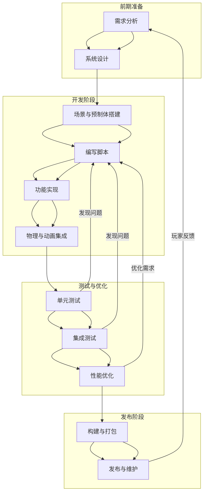

# 程序工作流

在开展工作之前，除了基础技术栈，程序（软件工程师）应当掌握以下技术、工具和规范：

### **代码规范**

我们要求所有的代码都应当遵循一定的代码规范，以保证代码的质量和可维护性。请参考并遵循以下规范：
[使用 C#风格指南编写简洁且可扩展的游戏代码（Unity 6 版）](https://unity.com/cn/resources/c-sharp-style-guide-unity-6)

### **Unity 项目资源命名与管理规范**

1. **命名原则**

   - 避免使用 base、basic 等模糊词汇（如果使用，用 `base` 而非 `basic`），建议用具体、能体现功能或用途的名称。
     - 示例：用 `PlayerController` 代替 `BaseController`。
   - 所有资源文件（如 Prefab、ScriptableObject、场景、材质、纹理等）统一采用大驼峰命名法。
     - 示例：`MainMenuScene`、`CardSO`、`PlayerAvatarTexture`。
   - 命名时注意单复数：
     - 多个对象用复数形式，如 `Cards` 文件夹。
     - 集合类 ScriptableObject 用单数，如 `CardSO`。

2. **文件夹与资源分类**

   - 同类对象超过 2 个时，建议新建文件夹分类，便于查找和管理。
     - 示例：`UI/Buttons` 文件夹下存放所有按钮相关预制体。
   - 同一文件夹下的多个继承类建议以基类为前缀命名。
     - 示例：`CardView`、`CardViewNormal`、`CardViewMini`。

3. **ScriptableObject 命名规范**

   - 所有 ScriptableObject 以 `SO` 结尾。
     - 示例：`CardSO`、`ItemSO`。
   - 汇总型 ScriptableObject 以 `All` 开头，且不加复数，名称与元素 SO 保持一致。
     - 示例：`AllCardSO`、`AllItemSO`。
   - 映射型 ScriptableObject 以 `Mapping` 结尾，名称中需体现映射关系。
     - 示例：`CardSOPrefabMapping`（表示 CardSO 与 Prefab 的映射关系）。

4. **场景化说明**

   - 当你新建一个角色预制体时，请用如 `PlayerPrefab` 命名，并放入 `Prefabs/Players` 文件夹。
   - 如果你需要存储所有卡牌的数据，请新建 `CardSO`，如果需要存储所有卡牌的集合，则新建 `AllCardSO`。
   - 如果你要建立卡牌与预制体的对应关系，则新建 `CardSOPrefabMapping`。

5. **常见错误提示**
   - 不要在同一个文件夹下混用单数和复数命名。
   - 不要用 `Base`、`Test`、`Temp` 等临时性词汇作为正式资源名。
   - 命名时避免拼写错误和大小写不一致。

### **注释**

这里是一些需要额外强调的注释规范：

1. 使用 XML 文档注释（`///`）描述公共方法和 API。
2. 注释代码的意图，而非实现细节。
3. 使用 `TODO` 注释标记未完成的工作。
4. 保持注释风格一致。
   - 使用 `//` 单行注释。（快捷键 Ctrl + /）
   - 使用 `/* */` 多行注释（尽量避免使用，除非必要）。

### **工作流**

