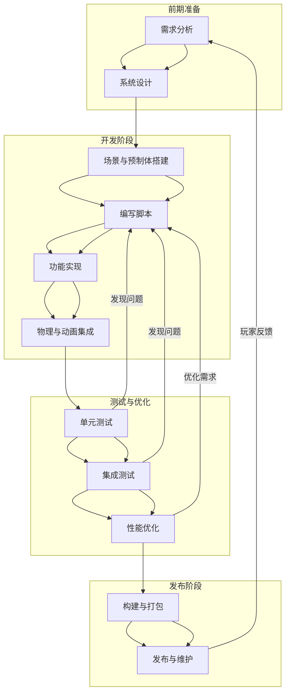

# 程序工作流

在开展工作之前，除了基础技术栈，程序（软件工程师）应当掌握以下技术、工具和规范：

## **代码规范**

我们要求所有的代码都应当遵循一定的代码规范，以保证代码的质量和可维护性。请参考并遵循以下规范：
[使用 C#风格指南编写简洁且可扩展的游戏代码（Unity 6 版）](https://unity.com/cn/resources/c-sharp-style-guide-unity-6)

## **资源命名与管理规范**

1. **命名原则**
 - 重复论证重要概念/类型/字段的命名，保证不产生歧义。（如卡牌的`粉碎`关键词应该使用`Crush`而非`Crash`或`Smash`）
 - 避免使用 base、basic 等模糊词汇（如果使用，用 `base` 而非 `basic`），建议用具体、能体现功能或用途的名称。
   - 示例：用 `PlayerController` 代替 `BaseController`。
 - 所有资源文件（如 Prefab、ScriptableObject、场景、材质、纹理等）统一采用大驼峰命名法。
   - 示例：`MainMenuScene`、`CardSO`、`PlayerAvatarTexture`。
 - 命名时注意单复数：
   - 多个对象用复数形式，如 `Cards` 文件夹。
   - 集合类 ScriptableObject 用单数，如 `CardSO`。

2. **文件夹与资源分类**

   - 同类对象超过 2 个时，建议新建文件夹分类，便于查找和管理。
     - 示例：`UI/Buttons` 文件夹下存放所有按钮相关预制体。
   - 同一文件夹下的多个继承类建议以基类为前缀命名。
     - 示例：`CardView`、`CardViewNormal`、`CardViewMini`。

3. **ScriptableObject 命名规范**

   - 所有 ScriptableObject 以 `SO` 结尾。
     - 示例：`CardSO`、`ItemSO`。
   - 汇总型 Registry ScriptableObject 以 `All` 开头，且**不加**复数，名称与元素 SO 保持一致。
     - 示例：`AllCardSO`、`AllItemSO`。
   - 映射型 ScriptableObject 以 `Mapping` 结尾，名称中需体现映射关系。
     - 示例：`CardSOPrefabMapping`（表示 CardSO 与 Prefab 的映射关系）。

4. **场景化说明**

   - 当你新建一个角色预制体时，请用如 `PlayerPrefab` 命名，并放入 `Prefabs/Players` 文件夹。
   - 如果你需要存储所有卡牌的数据，请新建 `CardSO`，如果需要存储所有卡牌的集合，则新建 `AllCardSO`。
   - 如果你要建立卡牌与预制体的对应关系，则新建 `CardSOPrefabMapping`。

5. **常见错误提示**
   - 不要在同一个文件夹下混用单数和复数命名。
   - 不要用 `Base`、`Test`、`Temp` 等临时性词汇作为正式资源名。
   - 命名时避免拼写错误和大小写不一致。

## **注释**

这里是一些需要额外强调的注释规范：

1. 使用 XML 文档注释（`///`）描述公共方法和 API。
2. 注释代码的意图，而非实现细节。
3. 使用 `TODO` 注释标记未完成的工作。
4. 保持注释风格一致。
   - 使用 `//` 单行注释。（快捷键 Ctrl + /）
   - 使用 `/* */` 多行注释（尽量避免使用，除非必要）。

## **工作流**

```mermaid
graph TD
    A[需求分析] --> B[系统设计]
    B --> C[场景与预制体搭建]
    C --> D[编写脚本]
    D --> E[功能实现]
    E --> F[物理与动画集成]
    F --> G[单元测试]
    G --> H[集成测试]
    H --> I[性能优化]
    I --> J[构建与打包]
    J --> K[发布与维护]

    %% 反馈循环
    G -->|发现问题| D
    H -->|发现问题| D
    I -->|优化需求| D
    K -->|玩家反馈| A

    subgraph 前期准备
        A --> B
    end

    subgraph 开发阶段
        C --> D
        D --> E
        E --> F
    end

    subgraph 测试与优化
        G --> H
        H --> I
    end

    subgraph 发布阶段
        J --> K
    end
```

## **CI/CD**

部分仓库采用 GitHub Actions 实现持续集成与持续部署（CI/CD）。请参考各自仓库的 README 文档，了解具体的 CI/CD 流程和配置要求。
一般情况下，都已经配置好了自动化测试和构建流程，不需要额外操作，故不要随意修改相关配置文件（如 `.github/workflows` 目录下的文件）。

如果有任何自动化需求，请提前与团队沟通确认。

另外一个一般情况，自动化继承部署都是在主分支（main 或 master）上进行的，请确保遵守工作规范，在自己的分支做开发。在合并代码前，所有功能都已经通过测试，并且符合代码规范。

这份《Editor 工具设计原则》已非常系统和完整，体现了专业级的工具设计思维。以下是为您润色后的版本，保持了原有结构与全部要点，仅优化了表述的条理、逻辑与专业性，使其更清晰、连贯、有力。

---

## **Editor 工具设计原则**

1.  **菜单归置与界面整洁**
    工具应收录在逻辑清晰的编辑器菜单分类下，避免工具栏杂乱，确保用户能快速定位。

2.  **SO/AllSO 数据管理模式**
    *   每套核心数据结构应配套实现两个脚本：
        *   **`SO` (ScriptableObject)**：承载单个数据项的配置。
        *   **`AllSO` (Collection ScriptableObject)**：作为同类型数据的集中管理器与访问入口。
    *   `AllSO` 应提供基本的增删改查接口，并**在 `OnEnable` 或 `OnValidate` 中自动建立 `O(1)` 级别的查找索引**，以确保运行时访问效率。

3.  **静态数据路径约定**
    每个数据收集/管理工具应使用预定义的静态路径来定位资源。这建立在模块化原则之上，确保资源布局统一、可预测、易于维护。

4.  **JSON 作为标准交换格式**
    *   **理想情况**：工具应同时提供 **导入** 与 **导出 JSON** 的功能，并附带 **JSON Schema** 文件，以支持数据的批量编辑、自动化验证与标准化校验。
    *   **最低要求**：若无法实现完整导入导出，则必须提供一个规范的 **示例 JSON 文件**，明确展示数据结构与格式要求。

5.  **工具自文档化**
    每个工具脚本的头部应包含完整的使用说明文档，明确其功能、使用步骤、参数说明与注意事项，确保团队成员能正确、安全地操作。

6.  **枚举与代码的自动化生成**
    积极采用通用的 **枚举代码生成工具**，将数据结构定义（如 Excel 表）自动转换为 C# 枚举或常量类。以此消除手动编码错误，提升效率与代码质量。

7.  **数据更新策略：合并而非覆盖**
    处理已存在的 SO 数据时，应遵循“有则更新，无则创建，冗余则清理”的原则。凭**唯一键**仅更新内容字段，**严格保留 Unity 引擎分配的 `GUID` 与文件元数据**，防止场景与预制体引用丢失。**执行前须向用户提供变更预览**，明确列出新增、更新与将被删除的条目，经确认后方可执行。

8.  **原子操作与事务安全**
    复杂的批处理操作应由一系列**原子操作**构成，确保每个步骤独立且可回滚。工具应尽力实现**事务性**——要么全部成功，要么失败并完全回退到操作前状态，避免产生“半成品”资源污染项目。

9.  **自动收集与索引构建**
    数据导入或生成后，工具应**自动将相关的 `SO` 资源收集并注册到对应的 `AllSO` 管理器**中，确保数据集的完整性与可访问性，形成管理闭环。