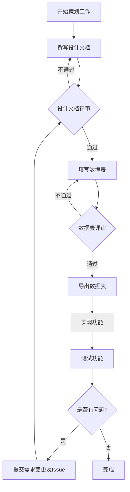

# 策划工作流

在开展工作之前，除了基础技术栈，策划应当掌握以下技术、工具和规范：

### **程序思维**

熟练掌握一门编程语言是策划人员的基本素质，能够帮助你更好地理解游戏逻辑和数据处理；尤其在功能设计方面，能够以程序设计的思维来思考问题，并省去大量的冗余设计和无效沟通。

举例说明。设计一个战斗流程功能时，未掌握编程语言的策划人员可能会设计出一个复杂却又不完善的流程图，用大量的精力描述一个自以为困难且复杂实则引擎或语言特性早已提供的方法、或是用大量的逻辑判断流程图来描述一个应该使用另一种更简介合理的拓扑关系。

**策划无需成为程序员，但必须掌握游戏工程化设计的要素 ​**​：

1. **数据结构敏感度** ​​
   理解程序是数据驱动的，数据结构是程序的核心。设计时应当优先考虑数据结构的合理性和可扩展性。
   优先设计数据结构而非流程图，理解数据-逻辑和视图的关联与分离。
2. **逻辑控制流表达力和简化力**
   使用尽量简单和合适的逻辑表达式和控制流，避免过度复杂的条件判断。
3. **封装抽象意识** ​​
   识别重复模式转化为函数或类，避免重复造轮子。
4. **设计模式理解**
   理解常用设计模式，如单例模式、观察者模式、状态模式等，并能在设计中合理应用。
5. **边界思维** ​​
   预设输入校验和异常处理，避免逻辑漏洞。
6. **模块分割**
   将复杂逻辑拆分为小模块，并逐个实现和测试。了解已经存在的模块和已经开放的 API，避免重复造轮子或制作当前设计工作范围之外的功能。
   如果需要额外的 API，请先与程序沟通，确认是否可以实现，切勿过度设计。

如果你是策划人员中的**系统/数值策划**，应当掌握 `Lua` 的基本语法和使用方法，并且尽量使用 `Lua` 设计数据和实现逻辑。`Lua` 是一种轻量级的脚本语言，适合用于游戏中的数据驱动设计。

实现是指可以将自己的设计转化为 Lua 脚本，在与程序合作之前，就能够通过自己的单元测试验证自己的设计，而非让程序消耗更多的时间用于重构。

### **Excel**

使用 Excel 设计数据时，应当注意以下原则：

- **数据规范化**：避免多余空格、空白行或空白列。
- **表头标准化**：采用唯一列名，使用大驼峰命名法。尽量不要使用中文。
- **数据类型规范化**：避免混合数据类型，保证与设计原意一致。
- **禁止合并单元格**：合并单元格会影响数据分析和处理。
- **工作表命名规范化**：为每个工作表起一个清晰的名字。
- **使用公式**：避免硬编码，尽量使用公式计算数据。
- **数据验证**：在枚举类型的列使用数据验证功能，确保数据的有效性和一致性。

### **MediaWiki**

我们使用个人部署的 `MediaWiki` 作为团队的知识库，因此应当掌握 `MediaWiki` 的基本使用方法，包括但不限于：

- 理解 `MediaWiki` 的基本原理，懂得浏览和维护 `MediaWiki` 页面。
- 熟练掌握 `MediaWiki` 的基本语法，包括标题、列表、表格、链接等。它和 `Markdown` 有很多相似之处，但也有很多不同之处，应当注意区分。
- 熟练使用 `MediaWiki` 的模板功能，以便于更好地组织文档。

### **Yarn Spinner**

我们使用 `YarnSpinner` 作为对话脚本的编写工具，因此应当掌握 `YarnSpinner` 的基本语法和使用方法。
如果你是策划人员中的**编剧**，建议深入学习 `YarnSpinner` 的高级特性，如状态机、变量和条件分支等。

Yarn Spinner 是一个专门为交互式故事设计的简单的标记语言。

#### 预览对话

1. 在 Vscode 中安装 Yarn Spinner 插件
2. 在 Vscode 中打开 Yarn 文件
3. 在编辑器中按下 **Ctrl+Shift+P**
4. 输入"Preview Dialogue"，回车

#### 参考

[Yarn Spinner 在线编辑](https://try.yarnspinner.dev/)
[Yarn Spinner 文档](https://docs.yarnspinner.dev/beginners-guide/)  
[FAQ in Unity](https://docs.yarnspinner.dev/using-yarnspinner-with-unity/faq)

### **工作流**

