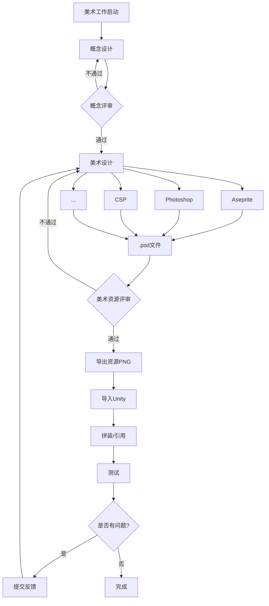

# 美术工作流

在开展工作之前，除了基础技术栈，美术应当掌握以下技术、工具和规范：

### **Photoshop**

我们推荐使用 `Photoshop` 进行 2D 美术设计，但是不强制要求。然而提交的终端应当是 `PSD` 文件。具体原则可以查看后续章节的[美术工作流](#美术工作流)。在此，列出一些基本的工作原则，不涉及具体的技术细节：

- **图层命名**：图层命名应当简洁明了，能够清晰表达图层的内容，不允许出现无意义的图层命名。
- **图层分组**：图层应当按照功能进行分组，以便于后续的管理和导出，一个拥有多层的实体应当对应一个同名的分组。
- **唯一性**：保证 `PSD` 文件的唯一性，借助 `Git` 进行管理，不可出现以日期命名或者无意义命名的文件。
- **导出**：无需导出 `PNG` 文件，应只提交 `PSD` 文件。

### **Spine**

为保证导入时的便捷性，在导入图片到 Spine 时，不应裁切图片，而是保持画布大小，以便于在 Spine 中进行统一调整。

### **工作流**

---



我们建议使用 Photoshop 进行绘图，并使用.psd 文件进行保存、转移和交接。
使用 Photoshop 进行绘图时，伴随软件特性产生的一些问题，需要特别注意。以下是一些常见的问题和解决方案：

## 像素画工作流程

- Photoshop 版本大于 2020
- 将图像插值调整为邻近
  
- 将高速缓存级别调至 2，高速缓存拼贴大小调至 128k，历史记录随意（取决于用户电脑配置）。
  
- 将标尺与文字单位调整为像素
  
- 使用铅笔工具绘画，关闭平滑，否则会导致画笔延迟漂移
  
- 使用油漆桶进行范围填色，容差调整为 0，禁用消除锯齿，连续选项视情况而定
  
- 使用橡皮工具进行修改，切换到铅笔模式
  
- 在执行图像缩放时，需要注意三点：
  - 为保证放大的像素不因奇偶差异而变形，应当通过调整图像的放大中心为左上 👉 使其 XY 坐标定位达到像素精确（例：10.00 像素）。
  - 应当使图像的放大倍数为整数倍，如 200%、300%，而非 150%或 112%
  - 插值必须调整为邻近
    

## 像素画的线条

## 斜线

像素画中的直线是由一系列的等长线段构成的。在像素画中，角度与线段的关系是这样的：


一般来说，在绘制角度时，应当遵循以下规则：

1. 22.5°(1/16)、30°(1/12)、45°(1/8)、60°(1/6)、90°(1/4)、是最基本的角度，应当尽量避免使用其他角度。
   由于像素的特性，这些角度可以保证线段的长度是整数像素，这样可以保证线段的清晰度。
   135°、225°、315° 是 45° 的倍数，也是可以接受的角度。
2. 像素线段长度和角度存在这样的关系：

```math
length = 90/angle - 1
```

这个公式可以帮助我们计算出在绘制特定角度时，线段的长度应当是多少。而该公式表明了一个重要的事实：在绘制介于 30° 到 60° 之间的角度时，线段的长度会产生不完美的像素，这是因为在这个范围内，线段的长度不是整数像素，这样会导致线段的不完美。应当尽量通过其他方式避免这种情况。


红色部分是危险区域，绿色部分是安全区域。在绘制时，应当尽量避免使用危险区域的角度。
当不得不使用危险区域的角度时，可以通过曲线来代替直线，这样可以一定程度上避免问题产生。

## 像素画的曲线

像素画中的曲线是由一系列长度等差的线段构成的。在像素画中，曲线的绘制是一个复杂的问题，因为曲线的长度和角度都会影响曲线的质量。

一个平滑的曲线中的线段长度 y 与线段次数 x 存在一定的相关性：


```math
A: y = x
B: y = [n/2]
C: y = [(n+1)/3]
D: y= 3n-2
E: 斐波那契数列
```

由此可得出推论：

1. 曲线一定符合数列规律，可以通过数列规律来推断曲线的长度。
2. 曲线的线段长度应当是整数像素，即使需要取整符号。

## 像素画的圆

在 Photoshop 中，如果使用**铅笔**进行圆的绘制，需要注意的是，笔刷的大小决定了圆的直径，基于此，圆必须是**奇数**像素，这样才能保证圆心在像素上。如果是偶数像素，圆心会落在像素之间，导致圆的不完美。
如果想要绘制直径为偶数像素的圆，可以通过绘制直径为奇数像素的圆，然后通过框选工具进行裁剪，这样可以保证圆心在像素上。


如图所示， 直径个位为 3~5、5~7 的圆之间有明显的阶梯感，它的最长线段长度会突变。
直径个位为 3 和 7 的圆存在像素不完美问题，需要手动调整修边。本图是已经修复后的。

## 像素画的视角

在像素画中，视角是一个重要的概念，它决定了物体的组成方式和绘制方式。
一个项目一般会有一个固定的视角，这样可以保证整个项目的一致性。

## Top-down 俯视视角

摄像机以固定角度观察被摄物体，在这种视角下，物体拥有两个面，一个是顶面，一个是立面。为了表现物体的立体感，除了两个面的对比度、高光（第三面）之外，还应该在设计图案的时候做好体积暗示。

### 高度问题

一个占地面积 2x2(x16)的立方体物体，高度为 2(x16)。那么问题来了，这个物体在实际绘制时它的立面和顶面的像素是怎么分配的呢？


如图所示，如果立面的像素长度按照本身的设计长度绘制，在俯视视角下它的体积不能被传达到位，因为摄像机的视角是 40°~45° 角(≈41.41∘)倾斜于地面的。


所以在尽可能保留顶面原大小的同时，立面的像素长度应当缩短，这样可以更好的传达物体的体积。缩短的公式如下：

```math
height' =  height * 3/4
```

对于像素游戏，视觉上的 3/4 视角通常通过美术调整，而不是依赖于精确的 3D 透视算法。角色和场景素的高度通常由手工像素美术来决定。

### 光照来源


1. 描边：一般情况下不进行绘制；
2. 顶面：受光面，物体的固有色；
3. 高光：物体中最亮的部分；
4. 立面：不受光的面，物体固有色的亮度降低版本。可能存在反光，反光挤压明暗交界线；
5. 投影：左右比形体各扩展 2px，以保证在有描边的情况下投影仍然能够正确显示。

俯视视角的光照来源无论在任何情况下都是默认顶光，且无色温影响。这代表了任何一个物体都**不应该**受光源着色，即是说，物体的亮暗面都是灰调的。

上述说法仅用于拥有后处理过程的游戏引擎，引擎会自动为物体进行光照上色。在其他绘制场景中，仍然需要对亮暗面进行色彩冷暖的调整。

死区缺陷问题 <https://zhuanlan.zhihu.com/p/686230441>

## Isometric 等距视角

待完善。

## Scroll-side 卷轴视角

卷轴视角的摄像机平行于被摄物体，这导致物体的立体感不明显。物体拥有 1~2 个面：有时作为背景的物体垂直于摄影机，只展示一个面，但是即便事实上垂直于摄影机的场合，也可能为了照顾体积感而绘制两个面。

这与摄影机的距离有一定的关系，距离越近，体积感越强；距离越远，露出的面就约少。

卷轴视角的光照来源本应是顶光，但是角度问题导致卷轴视角的物体没有顶面，因此我们在项目建立时就确定好光照来源（于左侧或是右侧）

一般情况下我们会选择左侧光源。但是某些环境自带光的情况下需要对亮暗面进行调整，甚至使用法线贴图。不过大部分情况下，这是不必要的——玩家往往不会注意到这些细节。


如图所示，这是一个通过亮暗面加上些微的边缘宽度调整体现物体体积的例子。

大部分情况下，光照射进场景的范围是有限的，距离稍远的物体受光影响较小。另外，远处的物体的颜色应当更灰，以表现大气的影响。但是这存在例外。在某些情况下，极远处的物体应当更亮，以表现远处的外部光源，如远山、远处的建筑等，这些物体应当更亮、融入天空。

## 置入

痛点：

1. 直接置入会因为坐标重置、DPI 自动调整等原因偏移图片的周围像素；
2. 如果通过复制图层的方式无损置入，会丢失图片的名称；

最优解：先通过引擎或其他 Batch 方式给需要的图片加上透明描边，然后统一拖入 Photoshop 中，这样可以保证图片的描边一致性。

详细参考[文件目录](./Preprocessing/addTransparentBorder.py)。

在 Photoshop 中，图片的批量置入需要注意以下几点：

- 原始文档的 DPI 需要与置入图片的 DPI 一致，否则会导致图片的像素丢失——即使在设置中设定了“不缩放”；
- 应当在设置中将置入的图片自动转换为智能对象，以便于后续的修改；
- 置入后，应当选择智能对象，并右键图层，选择“恢复缩放”以保证图片的原始尺寸。

## 图层

- 不同物体需要分层。
- 在设计上有特别的的叠压关系时应当单独分图层，如侧面的阳台。
- 允许合层的情况：

- 不影响结构整体性的
- 不影响或没有交互方式的
- 可以作为整体 SpriteSheet 裁切的

- 图层命名必须统一且明确，名称采用大驼峰，并用下划线连接名称和它的属性，如 Shadow、Back、Front、Frame 等字段。出现“图层”“拷贝”等名称是**不被允许**的，这样的图层不应当加入导出序列，仅用作指示画面效果。下面是一个例子：

- House_Back
- House_Front
- House_Frame_1
- House_Frame_2
- House_Texture
- House_Shadow

在导出时，也应当遵循这一规则，以保证导出的文件名和图层名称一致。

- 可以定义图层名称属性的缩写，应当说明。以下是一些常用的缩写和意义：

  | 缩写 | 英文    | 含义       |
  | ---- | ------- | ---------- |
  | b    | back    | 背后       |
  | f    | front   | 前，可省略 |
  | s    | side    | 侧面       |
  | w    | shadow  | 投影       |
  | t    | texture | 材质、纹理 |

## 描边

- 在设计时应当保留物品的边缘尺寸，以便于在游戏中添加自动描边。举例说明：在绘制一个 32x32 的物品时，应当在物品的边缘留出**1px 的空白**，也就是说物品的实际尺寸为 30x30，这样在游戏中添加描边时就不会出现物品之间的重叠。
- 以下情况**绝不允许**：
- 使用现实的图片直接作为底图描绘，再在上面进行修改。
- 除非有特殊需求，绘制时半透明笔刷直接出现在画布上。这会导致游戏中颜色自动描边后的异常混合。
- 当一组物体的描边是选择性的，整体中存在不需要描边的地方，应当在预定的描边位置绘制**alpha = 10% ~ 20%**的黑色，引擎会自动识别并将此处颜色重设为**全透明黑色**。
- 当一组物体的描边是不需要的，就不必再预留 alpha，直接绘制即可。

## 投影

- 投影一般情况下**alpha = 33%**，颜色为黑色。如果主体有描边，投影应该在两侧扩展至少**1px**，以保证投影的完整性。
- 如果一个物体的投影是选择性的，已经在主体上绘制了硬性投影（环境光遮蔽），仍然需要导出相应的投影文件，该文件可以是空图片。

## 发光贴图

由于采用了 URP 渲染管线，我们可以使用 Emission Map 来实现发光效果。

需要为发光部分单独绘制一张贴图，贴图的尺寸应当与主体贴图一致。在需要发光的位置用任何需要的颜色标注，其明亮程度可以通过控制 Alpha 调整。

在导出时，应当将发光贴图与主体贴图分开导出，以保证在游戏中的正确使用。

在 Unity 中，发光贴图的 TextureType 应当设置为 Default，并在原有的贴图编辑器(Edit Sprite) 中，添加一个**Secondary Texture**，将其名称设置为**\_EmissionMap**，然后将发光贴图拖入其中。

这样结合 URP 的 Volume 设定 (**threshold = 1,intensive = 0.3**) 就可以实现指定发光的效果。

这样的功能是通过 shader 中 HDR 颜色来辅助实现的，因为 HDR 颜色强度可以超过 1，所以我们可以通过这种方式来指定阈值大于 1 的贴图来实现发光效果。

# 地牢饿徒实践

本章节讨论了在游戏《地牢饿徒》中的一些特别的设计规范和技巧。本游戏是一个 2D 像素风格的游戏，经历的版本同时进行了 Topdown 和 Sidescroll 视角的绘制，在 Unity 中使用了 Shader, URP 等技术，因此具有一些参考价值。

## 地图实体 Map Object

指拥有体积和碰撞的物体 Prefab。

## 碰撞体

在具体的 SpriteRenderer 上添加碰撞体，而不是在空物体或父物体上添加，这可能会导致碰撞体重叠或者不符合物体形状。

在制作拥有严格形状的碰撞体时，应该采用 Polygon Collider 2D ，而不是 Box Collider 2D 。这样可以更好地适应物体的形状。

适用 Polygon Collider 2D 时，可以预先在 Sprite 中定义物理形状 **Custom Physics Shape** ，这样可以更好地适应物体的形状。

## 投影与光效

为了光效表现，应该在物体上添加 Shadow Caster 2D。像碰撞体一样，Shadow Caster 也应该与物体的形状一致。

如果是一个物体中，有多个形状，那么应该为每个形状添加一个 Shadow Caster 2D。

添加后，在根物体上添加一个 Composite Shadow Caster 2D。

可能出现的问题：Edit Shape 编辑形状时可能出现锚点点击后自动归零的情况，这通常是因为物体的 Transform 有问题，Z 轴为 0 时会出现这种情况。

## 建筑

- 屋顶单独分层，为了屋顶的差异化和自定义。
- 在基本框架绘制完毕后绘制纹理层#tex，以保护原有结构色彩。
- 屋顶在绘制时，统一采用亮色进行绘制，并在完毕前将右侧房顶亮度调低 50。
- 投影一般情况位于建筑形状下方 5 格，比两侧各多 2 格，多出的 1 格是照顾到系统自动描边遮挡。

## 建筑的导入

- 注意在 GameObject 命名时，应当使用大驼峰命名法，如：House、Wall、Roof 等。
- 命名时，应当注意保留名称字段。
  以下是一些常用的字段和意义：

  | 字段            | 含义                                            |
  | --------------- | ----------------------------------------------- |
  | Shadow(#Shadow) | 投影，在 MapRenderer 预处理过程中将不会进行描边 |
  | #tex            | 材质纹理，用于保护原有结构色彩                  |
  | #Light          | 灯光物体，仅用于保存 Light 2D 灯光效果          |

- 导入图片时，由于图片大小的不确定性和重复修改性，不建议保存为 SpriteSheet，而是直接导入单张图片，以便于后续的修改。

- 请使用我们提供的工具进行导入后的预处理，16x 加透明描边。

## Unity 中复合物体描边的方法

我们提供了两种材质：`UnitOutline` 和 `UnitWithoutLine`。前者是带有描边的，后者是不带描边的。在导入时，应当根据实际需求选择。

### 1. 描边工具简介

**基本原理**：
功能由 `OutlineDrawer` 脚本实现，该脚本会在对象上遍历所有 `SpriteRenderer`，并根据为每个需要描边的对象生成一个描边副本，汇总到一个容器对象中。

- **材质资源**：
  - **不描边材质**：加载资源名称为 `"SpriteNoOutline"` 的材质，用于场景中正常状态下的 sprite。
  - **描边材质**：加载资源名称为 `"SpriteOutline"` 的材质，用于生成和显示描边效果。
- **容器对象**： 描边对象会被统一归类到名为 `#OutlineObjects` 的容器中，并添加 `SortingGroup`组件。并将该组件衬在最下层，确保描边在场景中的**整体**显示顺序。
  - 描边对象将以 `{原对象名称}_outline` 的命名规则创建，并初步挂在原对象下，随后根据情况调整归属。
- 每一个 Prefab 是一个描边整体，在整体中的任何物体都将共享整体的最大边缘描边。也就是说，如果将一个已经描边的预制体放进另一个预制体中，那么这个预制体的描边将会被覆盖。

### 2. 规则

- **描边组件**：确保父物体有 `OutlineDrawer` 组件，并在`Start()`方法中初始化该组件，如果是某些预设的类似`Class: MapObject`的物体类型，已经预设了描边组件，不需要再次添加。
- **组件可信**：确保场景中所有需要描边的对象都挂有具有 `SpriteRenderer` 组件的物体， 系统会为所有子对象（包括自身的 `SpriteRenderer`）遍历生成描边对象。如果预设了描边，那么在游戏中就忽略这项描边工作。为保证一致性，笔者建议在导入、制作 Prefab 时不要预设描边，把工作交给自动化，做好标记即可。如果已经预设了描边 UnitOutline，理论上不会有影响，但是建议不要过多预设描边。
- **过滤**：系统自动过滤名称为 `"S(s)hadow"` 或名称以 `#` 开头的对象，这样可以避免不必要的描边生成；因此应当规范对象命名，避免与过滤条件冲突。
- **测试**：在各个场景环境下测试选中与非选中状态下描边的层级及外观，确保无论对象重叠或场景复杂时描边都能正确显示。

- **静态**：如果对象为静态描边——通常在场景中希望默认显示描边，并且不随选中状态改变其渲染层级。在根目录添加一个名为 `$` 的空物体。
  - 对于静态描边，工具会调整容器的 `SortingGroup`，若 `isDefaultOutlined` 为 `true`，将其排序顺序设置为选中状态值 **4**，并使排序在根节点生效。

### 3. 描边样式与状态

本章节了解即可，不需要进行操作。

- **常规状态**：

  - 默认情况下，描边颜色为 **黑色**，排序图层为 `"DungeonOutline"`，排序顺序为 **-100**，确保描边在大部分情况下位于背景层。

- **选中状态**：

  - 被选中时，描边颜色变为 **白色**。同时，描边的材质会切换为描边材质，并将排序图层及排序顺序调整为：
    - 排序图层：**Foreground**
    - 排序顺序：**4**

- **材质切换**：
  - 当状态切换（如选中/取消选中）时，描边对象会根据当前的 `isDefaultOutlined` 状态来切换使用的材质：
    - 非选中状态且不是默认描边：使用不描边材质 `"SpriteNoOutline"`；
    - 选中状态：始终使用描边材质 `"SpriteOutline"`。
