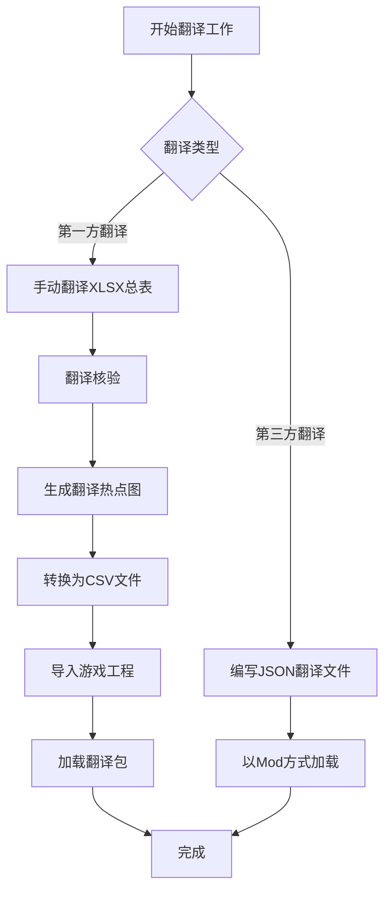

## 翻译工作流

在开展工作之前，除了基础技术栈，翻译应当掌握以下技术、工具和规范：

### 第一方人工翻译 (Localization,l10n)

特指在游戏开发时的第一方翻译。在总表 `xlsx & xlsm` 中手动翻译。
此过程原则上应当保证无机器翻译或 AI 翻译混杂，以保证翻译的高质量。

#### 翻译核验

在完成翻译工作后，应当翻译核验，目的是筛选翻译的问题，包括但不限于：

1. 机器翻译成分过高；
2. 原文修改后未及时更新翻译；
3. 专有名词、保留词未翻译或错译；

通过翻译核验生成翻译热点图，以便于后续的翻译工作。

#### 翻译导入

完成本次翻译迭代后，将翻译文件转换成`i18n_item.csv`和`i18n_item_d.csv`。
提交后，游戏工程应当引入翻译包(`Package`)，并在游戏启动时加载翻译包。
通过内置的 `Localization`，手动将翻译文件导入到已有的 `Localization` 表格中。

#### 第三方人工翻译 (Internationalization, i18n)

特指游戏产品化之后的基于游戏的追加翻译，可对原本翻译内容覆盖。
第三方翻译不适用 `csv` 文件，而是使用 `json` 文件映射 `key` 。
在翻译完成后，将以类似 `Mod` 的方式动态加载。

### 工作流

本章节以物品为例讨论游戏翻译工作流。
